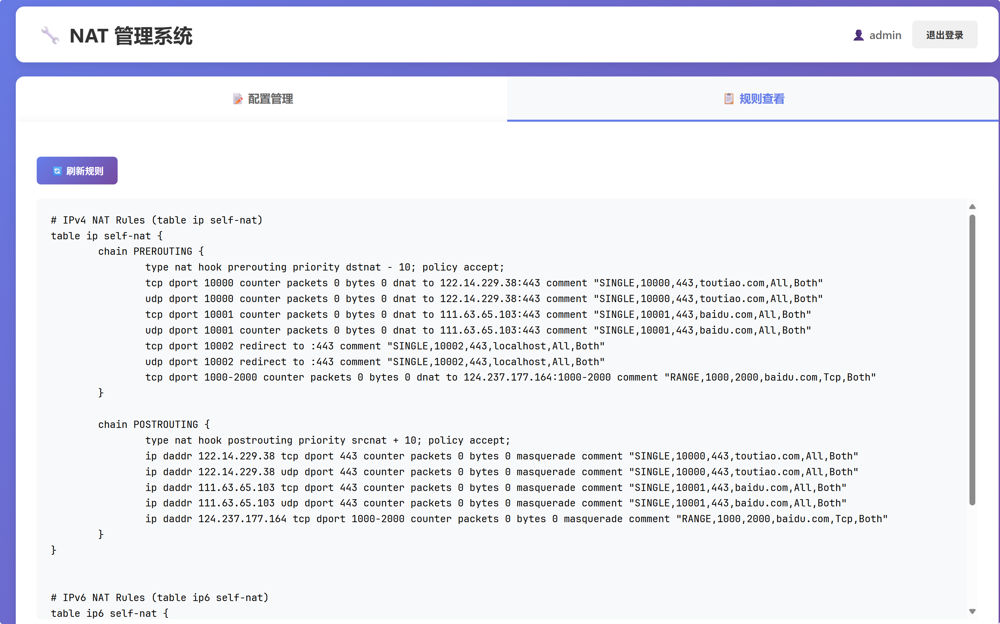

# NFTables NAT Rust

[](https://opensource.org/licenses/MIT)
[](https://www.rust-lang.org)

基于 nftables 的高性能 NAT 端口转发管理工具，使用 Rust 语言开发。

## ✨ 核心特性

- 🔄 **动态 NAT 转发**：自动监测配置文件和目标域名 IP 变化，实时更新转发规则
- 🌐 **IPv4/IPv6 双栈支持**：完整支持 IPv4 和 IPv6 NAT 转发
- 📝 **灵活配置**：支持传统配置文件和 TOML 格式，满足不同使用场景
- 🎯 **精准控制**：支持单端口、端口段、TCP/UDP 协议选择
- 🔌 **本地重定向**：支持端口重定向到本机其他端口
- 🐋 **Docker 兼容**：与 Docker 网络完美兼容
- ⚡ **高性能轻量**：基于 Rust 编写，仅依赖标准库和少量核心库
- 🚀 **开机自启**：支持 systemd 服务管理，开机自动启动
- 🔍 **域名解析**：支持域名和 IP 地址，自动 DNS 解析和缓存
- 🖥️ **Web 管理界面**：提供可视化的 WebUI 管理配置和查看规则




## 🖥️ 系统要求

适用于以下 Linux 发行版：

- CentOS 8+ / RHEL 8+ / Fedora
- Debian 10+ / Ubuntu 18.04+
- 其他支持 nftables 的现代 Linux 发行版

## ⚙️ 系统准备

### CentOS / RHEL / Fedora

```bash
# 关闭 firewalld
systemctl disable --now firewalld

# 关闭 SELinux
setenforce 0
sed -i 's/SELINUX=enforcing/SELINUX=disabled/' /etc/selinux/config

# 安装 nftables
yum install -y nftables
```

### Debian / Ubuntu

```bash
# 安装 nftables
apt update && apt install -y nftables

# 禁用 iptables（可选）
systemctl disable --now iptables
```

## 📦 快速安装

> 升级也使用相同的安装命令

### 方法一：TOML 配置文件版本（推荐）

```bash
bash <(curl -sSLf https://us.arloor.dev/https://github.com/arloor/nftables-nat-rust/releases/download/v2.0.0/setup.sh) toml
```

### 方法二：传统配置文件版本

```bash
bash <(curl -sSLf https://us.arloor.dev/https://github.com/arloor/nftables-nat-rust/releases/download/v2.0.0/setup.sh) legacy
```

## 🆕 WebUI 管理界面

本项目现已支持 Web 管理界面，可以通过浏览器方便地管理 NAT 配置。

- 🔐 基于 JWT 的安全认证
- 🔒 支持 HTTPS/TLS 加密传输
- 📝 可视化编辑配置文件（支持传统格式和 TOML 格式）
- 📋 实时查看 nftables 规则
- 🎨 现代化的用户界面

### 安装管理界面 WebUI

```bash
bash <(curl -sSLf https://us.arloor.dev/https://github.com/arloor/nftables-nat-rust/releases/download/v2.0.0/setup-console.sh) 5533
```

1. 安装过程会交互式提示输入用户名和密码。密码会保存在 systemd 文件中，注意安全。
2. 监听端口默认为 5533（可通过第一个参数修改）。
3. 为保证密码安全，安装过程中使用 openssl 自动签发自签名 TLS 证书。
4. 安装脚本会自动检测现有 NAT 服务的配置格式，并根据配置格式生成相应的 systemd service 文件。

安装完成后，访问 `https://your-server-ip:5533` 即可使用管理界面。详细文档请查看 [webui/README.md](webui/README.md)

### 升级 WebUI

```bash
DOWNLOAD_URL="https://us.arloor.dev/https://github.com/arloor/nftables-nat-rust/releases/download/v2.0.0/nat-console"
TMP_FILE="/tmp/nat-console"
INSTALL_PATH="/usr/local/bin/nat-console"
curl -L "$DOWNLOAD_URL" -o "$TMP_FILE"
echo "安装 nat-console 到 $INSTALL_PATH..."
install -m 755 "$TMP_FILE" "$INSTALL_PATH"
echo "nat-console 安装成功"
```


## 📝 配置说明

### TOML 配置文件（推荐）

配置文件位置：`/etc/nat.toml`

**优势**：

- ✅ 支持配置验证，保证格式正确
- ✅ 支持注释，便于维护
- ✅ WebUI 可视化编辑和验证
- ✅ 结构化配置，可读性更好

```toml
# 单端口转发示例
[[rules]]
type = "single"
sport = 10000          # 本机端口
dport = 443            # 目标端口
domain = "example.com" # 目标域名或 IP
protocol = "all"       # all, tcp 或 udp
ip_version = "ipv4"    # ipv4, ipv6 或 all
comment = "HTTPS 转发"

# 端口段转发示例
[[rules]]
type = "range"
port_start = 20000      # 起始端口
port_end = 20100        # 结束端口
domain = "example.com"
protocol = "tcp"
ip_version = "all"    # 同时支持 IPv4 和 IPv6
comment = "端口段转发"

# 单端口重定向示例
[[rules]]
type = "redirect"
sport = 8080         # 源端口
dport = 3128         # 目标端口
protocol = "all"
ip_version = "ipv4"
comment = "单端口重定向到本机"

# 端口段重定向示例
[[rules]]
type = "redirect"
sport = 30001        # 起始端口
sport_end = 39999     # 结束端口
dport = 45678        # 目标端口
protocol = "tcp"
ip_version = "all"
comment = "端口段重定向到本机"

# 强制 IPv6 转发
[[rules]]
type = "single"
sport = 9001
dport = 9090
domain = "ipv6.example.com"
protocol = "all"
ip_version = "ipv6"    # 仅使用 IPv6
comment = "IPv6 专用转发"
```

### 传统配置文件

配置文件位置：`/etc/nat.conf`

```
# 单端口转发：本机端口 -> 目标地址:端口
SINGLE,49999,59999,example.com

# 端口段转发：本机端口段 -> 目标地址:端口段
RANGE,50000,50010,example.com

# 端口重定向：外部端口 -> 本机端口
REDIRECT,8000,3128

# 端口段重定向：外部端口段 -> 本机端口
REDIRECT,30001-39999,45678

# 仅转发 TCP 流量
SINGLE,10000,443,example.com,tcp

# 仅转发 UDP 流量
SINGLE,10001,53,dns.example.com,udp

# 以 # 开头的行为注释
# SINGLE,3000,3000,disabled.example.com
```

**配置格式说明：**

- `SINGLE,本机端口,目标端口,目标地址[,协议][,IP版本]`
- `RANGE,起始端口,结束端口,目标地址[,协议][,IP版本]`
- `REDIRECT,源端口,目标端口[,协议][,IP版本]`

## 🚀 使用方法

### 启动/停止服务

```bash
# 启动服务
systemctl start nat

# 停止服务
systemctl stop nat

# 重启服务
systemctl restart nat

# 查看服务状态
systemctl status nat

# 开机自启
systemctl enable nat

# 取消开机自启
systemctl disable nat
```

### 修改配置

修改配置文件后，程序会在 **60 秒内自动应用新配置**，无需手动重启服务。

```bash
# TOML 版本
vim /etc/nat.toml

# 传统版本
vim /etc/nat.conf
```

### 查看日志

```bash
# 实时查看日志
journalctl -fu nat

# 查看详细日志
journalctl -exfu nat

# 查看最近 100 行日志
journalctl -u nat -n 100
```

### 查看 nftables 规则

```bash
# 查看所有规则
nft list ruleset

# 仅查看 NAT 表
nft list table ip self-nat
nft list table ip6 self-nat6
```

## 🔧 高级配置

### 自定义源 IP（多网卡场景）

默认使用 masquerade 自动处理 SNAT。如需指定源 IP：

```bash
# 设置自定义源 IP
echo "nat_local_ip=10.10.10.10" > /opt/nat/env

# 重启服务
systemctl restart nat
```

## 🐋 Docker 兼容性

本工具已与 Docker 完全兼容。程序会自动调整 nftables 规则以适配 Docker 网络。

> **说明**：Docker v28 将 filter 表 forward 链默认策略改为 DROP，本工具会自动将其重置为 ACCEPT 以确保 NAT 规则正常工作。

## 📌 注意事项

### REDIRECT 类型限制

`REDIRECT` 类型工作在 PREROUTING 链，仅对外部流量有效：

- ✅ **有效**：外部机器访问重定向端口 → 成功重定向
- ❌ **无效**：本机进程访问重定向端口 → 不会重定向

**原因**：本机流量直接进入 OUTPUT 链，不经过 PREROUTING 链。

**示例**：

```bash
# 配置：REDIRECT,8000,3128
curl http://remote-server:8000  # ✅ 成功重定向到 3128
curl http://localhost:8000      # ❌ 不会重定向，直接访问 8000
```

### TLS/Trojan 转发

转发 TLS/Trojan 等加密协议时，常见问题是证书配置错误。

**解决方案**：

1. **简单**：客户端禁用证书验证
2. **推荐**：正确配置证书和域名，确保证书域名与中转机匹配

## 📄 许可证

本项目采用 [MIT License](LICENSE) 开源协议。

## 🔗 相关链接

- **项目地址**：https://github.com/arloor/nftables-nat-rust
- **问题反馈**：https://github.com/arloor/nftables-nat-rust/issues
- **前代项目**：[arloor/iptablesUtils](https://github.com/arloor/iptablesUtils)（不兼容）

---

**注意**：与旧版 iptablesUtils 不兼容，切换时请先卸载旧版或重装系统。
